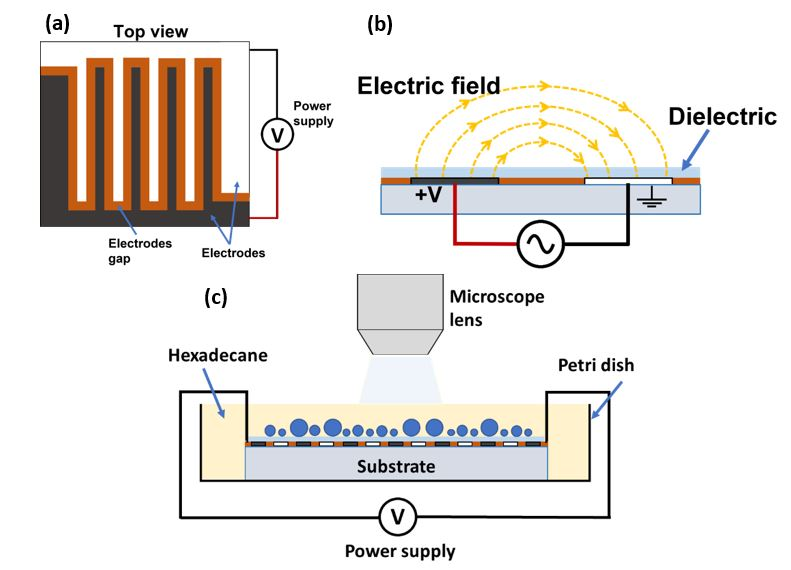

## Description

Severe satellite droplet ejection of an emulsion of water droplets in hexadecane media. Electric field is applied with patterned planar electrodes.

**Experimental conditions:**
   * Electrode spacing: 100 &mu;m 
   * Voltage: 400 V 
   * Frequency: 1 kHz
   * Surfactant (Span 80) concentration: 1 wt.%

**Experimental setup:**

